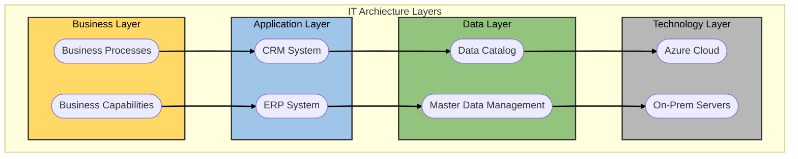
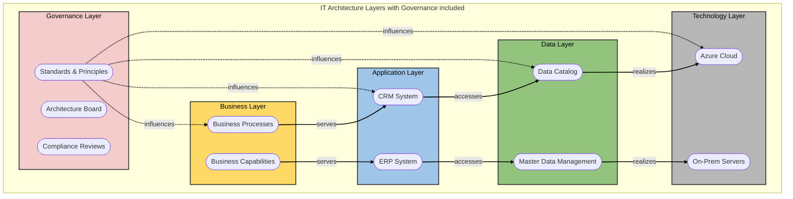
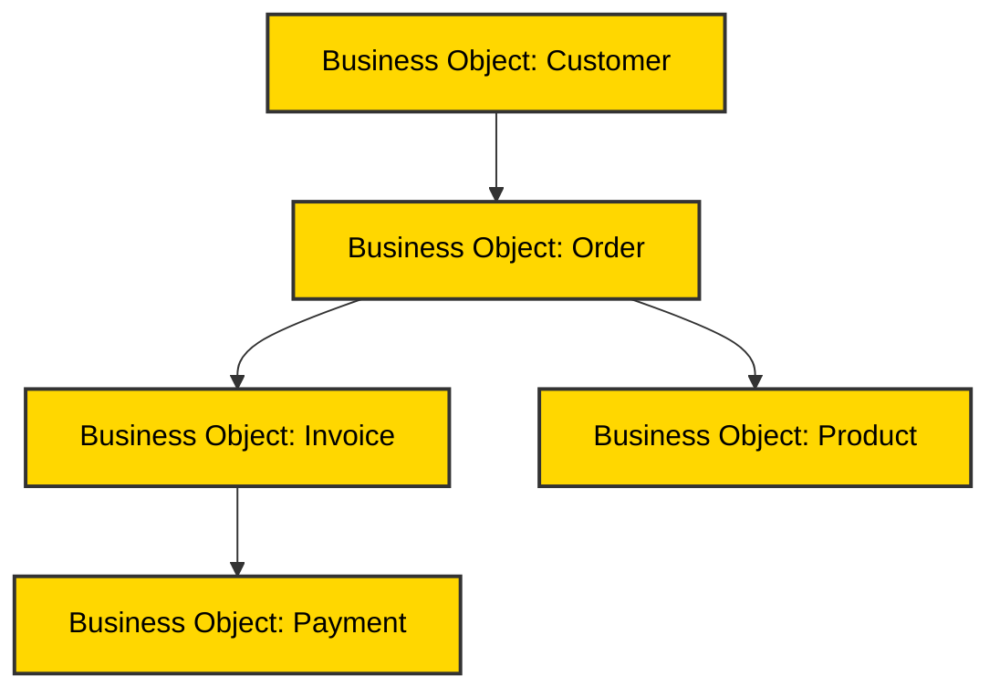
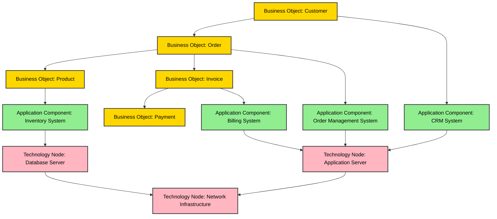
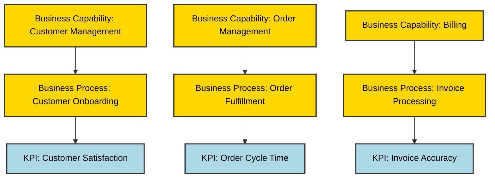
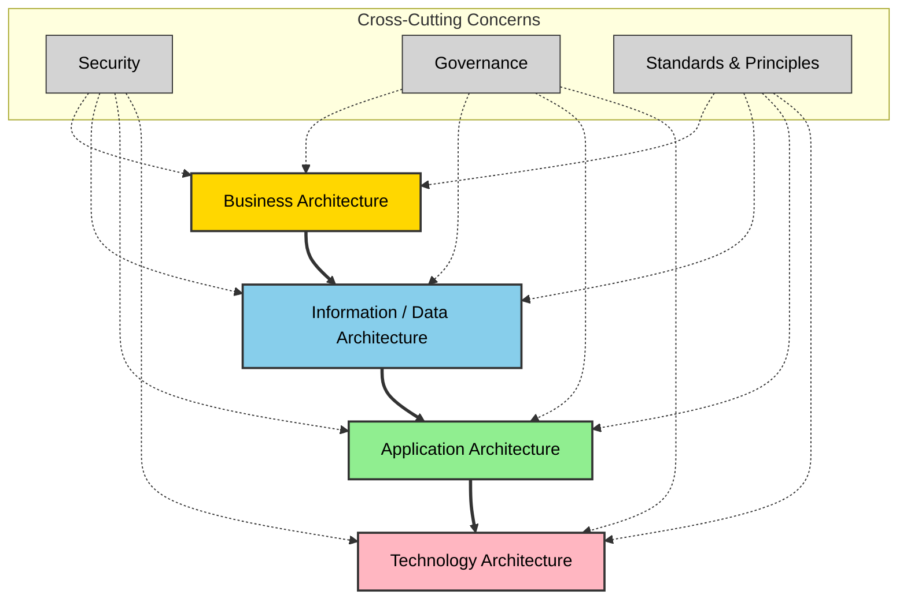

<text style="color:red;font-size:20px">This is just a collection of my thoughts regarding architectural work in the IT-space and should only be used for inspiration. The contents of this document is basically a brain dump of thoughts and ideas that have accumulated over the years and I just collect it here just in case it will be useful for anyone else.</text>

# Architecture
For me thoughts of "architecture" has been present in my mind for as long as I can remember. Maybe it's personality trait, but I wouldn't be surprised if it has something to do with me watching how my father always created smart tools and workarounds for things when he worked on cars, boats and houses. For the most part it was as a hobby, but at times it was a sidle hustle that almost turned into a carrier. When I started working as a software developer the first thing I bought was a book about design patterns and things just progressed from there.

Even when I was studying at a technical university I thought that the most important thing we were tought was not math, physics, programming etc, but rather how to analyze, categorize and solve different types of problems. The key word here is "**types**" which relates to design patterns and architecture in general.


## Purpose

### Purpose from a personal perspective
On a personal level architecture is important to me since I have an analytical mind that **craves clear goals** and **dislikes waste**. I very much like the **[DRY principle](https://en.wikipedia.org/wiki/Don%27t_repeat_yourself)** in software development which stands for **"Don't repeat yourself"** and states that "*Every piece of knowledge must have a single, unambiguous, authoritative representation within a system.*" A Swedish writer Esaias Tegnér (1782-1846) once said "*det dunkelt sagda är det dunkelt tänkta*" which roughly translates to the following:
```
if you can't articulate something clearly, you probably haven't thought it through properly either
```
So in general I want to see how what I'm doing a the moment is related to longterm goals and that those goals are clearly defined.

### Purpose from an IT organizational perspective
When it comes to the architectural work in an IT organization the purpose is to **create a structured, strategic foundation for technology and processes that support business goals**. It ensures that IT systems are aligned with the organization’s objectives, scalable, secure, and cost-effective. 

Key purposes:
1. Strategic Alignment
    - Ensures IT investments and solutions support business strategy.
    - Provides a common language and framework for business and IT collaboration.
2. Standardization and Governance
    - Defines principles, standards, and guidelines for technology use.
    - Reduces complexity and duplication by enforcing consistency across systems.
3. Risk Management
    - Identifies and mitigates risks related to technology choices, compliance, and security.
    - Supports regulatory adherence (e.g., GDPR, ISO 27001).
4. Cost Optimization
    - Avoids redundant systems and promotes reuse of components.
    - Enables better forecasting and budgeting for IT initiatives.
5. Scalability and Flexibility
    - Designs architectures that can adapt to future business needs.
    - Facilitates integration of new technologies without disrupting operations.
6. Communication and Transparency
    - Provides visual models and documentation for stakeholders.
    - Improves decision-making by clarifying dependencies and impacts.

In short, IT architecture work is about planning and governing the structure of systems, data, applications, and technology so that the organization can operate efficiently and evolve without chaos.






## Approach
Working with IT architecture to create a structured, strategic foundation involves aligning technology and processes with business objectives through a combination of approaches, frameworks, and processes.

The approach is typically business-driven and holistic to ensure that technology decisions support organizational goals. Key principles include:
- **Business Alignment**: Start from business strategy and capabilities, then derive technology needs.
- **Layered Thinking**: Separate concerns into layers (Business, Data, Application, Technology) for clarity.
- **Standardization & Governance**: Apply standards, principles, and policies to ensure consistency.
- **Iterative Development**: Use cycles for continuous improvement rather than one-off projects.
- **Cross-Cutting Concerns**: Embed security, compliance, and governance across all layers.

### Frameworks
Instead of trying to figure out everything from scratch yourself there are several established frameworks that you can use to guide you in your IT architecture work. A list of some frameworks can be found below. 

Adopting one or more frameworks can give you a number of benfits:
- **Consistency**: Common language and structure for architecture work.
- **Governance**: Clear rules for decision-making and compliance.
- **Alignment**: Ensures IT investments support business goals.
- **Risk Reduction**: Addresses security, compliance, and operational risks.
- **Scalability**: Frameworks provide reusable patterns for growth.

Examples of established frameworks:
- **TOGAF** (The Open Group Architecture Framework)
    - Defines the Architecture Development Method (ADM) for creating and maintaining enterprise architecture.
    - Organizes architecture into BDAT domains: Business, Data, Application, Technology.
- **Zachman Framework**
    - Provides a taxonomy for architecture artifacts based on perspectives (Planner, Owner, Designer, etc.) and aspects (What, How, Where, Who, When, Why).
- **ArchiMate**
    - A modeling language for visualizing relationships between business, application, and technology layers.
- **ITIL & COBIT**
    - ITIL focuses on service management; COBIT on governance and control.
- **DAMA-DMBOK** (for data architecture)
    - Guides data governance, metadata, and data quality practices.

### Processes
Frameworks give you tools that you can use, but you also need to define processes to ensure structured execution and goverance. TOGAF with its nine-phase sequential process can help you get started, but its important to relalise that its only a guide. If you after studying TOGAF decide to adopt it in your organization you must decide how to do it and how much to include. 

My strong recommendation is to adopt an interative approach where you start with things that quickly gives you a positive ROI, and where it is easy to see how the change contributes to fulfilling architectural goals and vision. Don't forget to make sure that the processes are not only something that will be a theoretical thing, but rather something that will be followed by people in the organization.


# TODO: CONTINUE WORK HERE


So how do you describe things clearly and avoid repetition? Part of it has to do with having a **vocabulary** (words, concepts etc) that people can understand. When that is done you need to define/decide the key things that are important for a particular business domain and a Way of Working (**WoW**) that fits your organization.

### Define a good business domain vocabulary

Doing this is essential for creating a shared understanding across the organization. Below is an example of a structured approach you can use to accomplish this.
- **1. Start with Business Capabilities**
Identify the core capabilities and processes of the organization.
Use these as anchors for the vocabulary (e.g., “Order Management,” “Customer Onboarding”).
- **2. Engage Stakeholders**
Involve representatives from **business units, IT, and operations**.
Ensure terms reflect how the business actually works, not just technical jargon.
- **3. Use Clear, Unambiguous Language**
Avoid synonyms and overlapping terms.
Each concept should have **one agreed definition**.
- **4. Align with Industry Standards**
Where possible, adopt terminology from frameworks like **ArchiMate**, **TOGAF**, or industry-specific standards.
This improves interoperability and reduces confusion.
- **5. Document Relationships**
Define **hierarchies and associations** (e.g., “Customer” relates to “Order” and “Invoice”).
Use diagrams or models to visualize these relationships.
- **6. Validate and Iterate**
Test the vocabulary in real scenarios (e.g., project discussions, requirements gathering).
Refine based on feedback and keep it **version-controlled**.
After this is done you might have a diagram of business objects looking something like this:

If you want to expand the diagram to include the application and technology layer it might look something like this:


### Define what is important for a particular business domain

This is important for everyone to know so that each and every person in an organization can understand if what they are doing is contributing to the whole. It is also the start for working out good KPIs (Key Performance Indicators). In order to succeed with creating KPIs which are meaningful, measurable and aligned with strategic goals a requirement is structured approach. This is one way to do it:

- **1. Start with Business Objectives**
    - Identify the **strategic goals** for the domain (e.g., increase customer satisfaction, reduce operational costs).
    - KPIs should directly measure progress toward these objectives.
- **2. Use SMART Criteria**
    - **Specific**: Clearly define what is being measured.
    - **Measurable**: Quantifiable with reliable data.
    - **Achievable**: Realistic given resources.
    - **Relevant**: Tied to business priorities.
    - **Time-bound**: Includes a timeframe for evaluation.
- **3. Map KPIs to Business Capabilities**
    - Link KPIs to **key processes or capabilities** in the domain.
    - Example: For **Order Management**, KPIs could include:
        - *Order Cycle Time*
*Order Accuracy Rate*
*Customer Complaints per 1,000 Orders*
- **4. Balance Leading and Lagging Indicators**
    - **Leading indicators** predict future performance (e.g., number of new leads).
    - **Lagging indicators** measure outcomes (e.g., revenue growth).
- **5. Ensure Data Availability**
    - Verify that data for the KPI is **accessible, accurate, and timely**.
    - Avoid KPIs that require manual collection or unreliable sources.
- **6. Validate with Stakeholders**
    - Engage business owners and IT to confirm KPIs are **understood and actionable**.
    - Avoid technical jargon—use business language.
- **7. Limit the Number**
    - Focus on **5–10 KPIs per domain** to avoid complexity.
    - Each KPI should have a clear owner and reporting cadence.
- **8. Document and Govern**
    - Define KPI **formula, data source, frequency, and target values**.
    - Maintain in a **central repository** for transparency.


#### Example KPIs:
| **KPI Name** | **Business Objective** | **Formula** | **Target** | **Owner** | **Frequency** |
| --- | --- | --- | --- | --- | --- |
|Customer Satisfaction|Improve customer experience|Avg survey score|≥ 90%|Head of CX|Monthly|
|Order Cycle Time|Reduce processing time|Avg time from order to delivery|≤ 48 hrs|Ops Manager|Weekly|
|Invoice Accuracy|Improve billing quality|(Correct invoices ÷ Total invoices) × 100|≥ 99%|Finance Lead|Monthly|
|System Uptime|Ensure service availability|(Available time ÷ Total time) × 100|≥ 99.9%|IT Operations|Daily|

#### Example of how KPIs can be linked to business capabilities and processes



### Define Way of Working



### Methods
I was once the first hire and tech lead in a startup where we had no external capital. In the beginning we basically had no money in the bank and everything was based on our software licences. Everything we did had to generate value fast, but we also had to be mindful of that things had to bring long term value as well (or at least not hinder it). The result was that we didn't change things that worked, but when some existing process or software became too time consuming complex to work with we to steps to change and/or automate things. In the changes we made we also tried to include things which would lessen the inpact of future changes. Examples include the following:

- Example 1: CRM
    - Basic usecase: When handling customers and licences manually in excel became too time consuming (as we grew) we created a small CRM to handle that for us. This enabled us to manage customers faster and easier.
    - Extension: We augmented the CRM with a web-API which (among other things) could return a software package given a licence key. This in turn enabled us to simplify our installation/update software to be very small and generic and able to handle software on both mobile and desktop devices. Before this all installtion software was delivered together with the application which in some cases made it necessary to send out things on DVDs using snail mail. This made it faster and easier to deliver software to customers which made them happy and enabled us to bill the customers faster.
- Example 2: Desktop application for medical decision support
    - Basic usecase: We had very strong indications that our existing customers had need of a desktop version of functionality that we so far mostly had for mobile devices so we quickly made that desktop application.
    - Exension: Since we were unsure of exactly what functionality might be requested the desktop application only included basic functionality (think the functions which might be found under the "File" menu in a desktop application). The rest of the functionality was implemented by way of dynamically loaded modules. Each module implemented a common interface enabling the main application to communicate with it. This enabled us to develop new (and even customer specific) functionality without having to touch the main application.

What the examples above describes are relatively small incremental changes which started as initiatives to minimize waste (example 1) and seize a market opportunity (example 2). In both cases the initial investment itself gave a positive RIO, but they also enabled extensions which added far more value to the business as well as the customers.

I have a lot more examples of how small efforts to eliminate irritating things in your work (and private) life can lead to big increases in productivity and efficiency (cost savings) combined with personal satisfaction and happiness. Don't underestimate how much contentment and happiness will improve productivity and profits in a company!

### The Traditional "old" Method

The way things used to be done was that all planning (including architecture) was decided before the actual work/implementation was started. This approach works well when the information model, [functional requirements](https://en.wikipedia.org/wiki/Functional_requirement) and [non-functional requirements](https://en.wikipedia.org/wiki/Non-functional_requirement) are very well defined, but runs into problems if one of the prerequisites are not fullfilled or the change during the implementation faze. Examples of things that can severly impact the implementation faze are changed requirements and problems/bugs which are major and/or discovered late in the project development cycle.

#### Pros of the Waterfall Model

- **Clarity and structure**: The model provides a clear, phase-by-phase structure, making it easy to understand and manage.
- **Well-defined goals and milestones**: All requirements are gathered and documented at the outset, providing clear objectives and predictable outcomes from the start.
- **Thorough documentation**: The emphasis on detailed documentation at each stage ensures comprehensive records for maintenance and future development, and facilitates information transfer to new team members.
- **Predictable budget and timelines**: Due to extensive upfront planning, it's easier to estimate project timelines and costs accurately.
- **Suitable for specific projects**: It works best for small projects with stable, clearly defined requirements and minimal risk of changes, such as in construction or systems with stringent regulatory compliance needs.
- **Less client intervention**: After the initial requirements phase, clients have minimal involvement, allowing the internal team to focus on development without continuous feedback loops.

#### Cons of the Waterfall Model

- **Inflexibility**: It is very difficult to go back and make changes once a phase is completed. Revisions can be complex and costly if issues are discovered late in the process.
- **Delayed testing**: Testing occurs only after the development phase is complete, which means issues and flaws are discovered late, increasing the risk and effort required to fix them.
- **High risk**: If the initial requirements are misunderstood or incomplete, the project has a high risk of failure because the final product might not meet the client's actual needs, and a functional version isn't available until the very end.
- **Limited client feedback**: The lack of ongoing client involvement can lead to dissatisfaction with the final product, as there are no opportunities for the client to provide feedback and guide the development process.
- **Resource-intensive initial phase**: The requirements and design phases can be time-consuming and demand significant resources for documentation.
- **Not suitable for complex or evolving projects**: It is a poor model for long, complex projects or those where requirements are likely to change.

### The Agile Method

The main ideas from Agile are based on Lean which is a word coined in the US 1988 and defined in 1996. This in turn was based on minimizing wastes (muda) as described by Toyota's Toyotas Production System from the 1950s and 1960s.

**The seven "wastes"** (muda in Japanese), first formulated by Toyota engineer Shigeo Shingo, are:
1. **superfluous inventory** - of raw material and finished goods
2. **overproduction** - producing more than what is needed now
3. **over-processing** - processing or making parts beyond the standard expected by customer
4. **transportation** - unnecessary movement of people and goods inside the system
5. **excess motion** - mechanizing or automating before improving the method
6. **waiting** - inactive working periods due to job queues
7. **making defective products** - reworking to fix avoidable defects in products and processes

A short way of describing it is **only change things which are contributing to waste**. Personally I think that is too shortsighted and I think that you should try to pave the way for future changes. This inevitably leads to a little waste since you can't predict exactly what future changes will be needed, but a business that never change will typically be rendered obsolete.

## Scope


## Stakeholders


## Context


## Timeline
